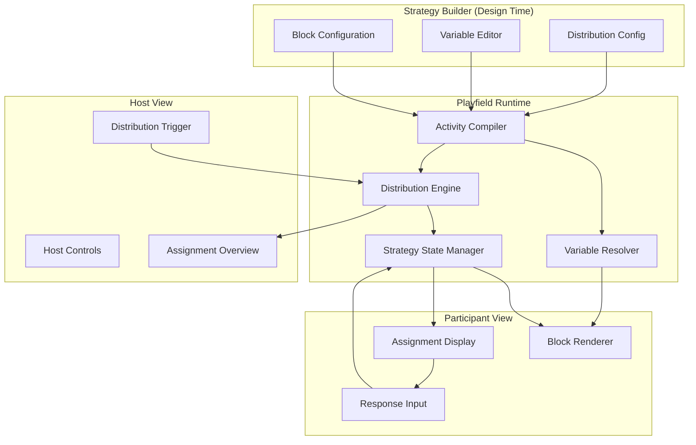

# Assignment Distribution Block Design Document

## Overview

The Assignment Distribution Block extends the Playfield Strategy Builder with variable interpolation and dynamic content assignment capabilities. This design enables SI leaders to create collaborative learning activities where participants review, respond to, or build upon each other's work through host-controlled distribution of array items (responses, questions, tasks) to individual participants.

The system consists of three main components: a variable interpolation engine that resolves template syntax to runtime data, an Assignment Display block type with configurable distribution algorithms, and enhanced host controls for triggering and managing assignments during live sessions.

## Architecture

### High-Level Architecture



### Core Components

#### 1. Variable Interpolation System

**Purpose**: Parse and resolve template variables in block content to display runtime data

**Responsibilities**:

- Parse `{{variable_name}}` syntax in block content
- Resolve variable paths using dot notation (e.g., `{{state.responses.current_user}}`)
- Support predefined accessors for common patterns
- Handle errors gracefully with helpful messages

#### 2. Assignment Distribution Engine

**Purpose**: Execute distribution algorithms to assign array items to participants

**Responsibilities**:

- Implement distribution modes (one-per-participant, round-robin, random, exclude-own)
- Handle item-participant mismatches based on configuration
- Generate assignment mappings
- Validate distribution feasibility

#### 3. Assignment Display Block

**Purpose**: Render assigned items to participants and provide response capabilities

**Responsibilities**:

- Display only items assigned to current participant
- Show waiting state before assignments are created
- Render response inputs when configured
- Handle author visibility settings

#### 4. Host Controls Enhancement

**Purpose**: Provide host interface for triggering and managing assignments

**Responsibilities**:

- Display "Assign" button when Assignment Display block is active
- Show distribution mode selector
- Display assignment overview after distribution
- Provide reassignment capabilities

## Components and Interfaces

### Variable Interpolation

#### Variable Resolver Interface

```typescript
interface VariableResolver {
  /**
   * Parse content and extract variable references
   */
  parseVariables(content: string): VariableReference[];

  /**
   * Resolve a variable path to actual data
   */
  resolve(variablePath: string, context: VariableContext): any;

  /**
   * Replace all variables in content with resolved values
   */
  interpolate(content: string, context: VariableContext): string;
}

interface VariableReference {
  raw: string; // e.g., "{{student_responses}}"
  path: string; // e.g., "student_responses"
  startIndex: number;
  endIndex: number;
}

interface VariableContext {
  state: PreviewState;
  userId: string;
  isHost: boolean;
  assignments?: AssignmentMap;
}
```

#### Predefined Variable Accessors

```typescript
const VARIABLE_ACCESSORS = {
  // Current user's data
  current_user: (ctx: VariableContext) => ctx.userId,

  // Assignment-specific accessors
  "assignments.current": (ctx: VariableContext) =>
    ctx.assignments?.participantAssignments[ctx.userId] || [],

  "assignments.all": (ctx: VariableContext) =>
    ctx.isHost ? ctx.assignments : null,

  // Response accessors
  student_responses: (ctx: VariableContext) =>
    Object.values(ctx.state.responses || {}).flat(),

  "student_responses.assigned": (ctx: VariableContext) => {
    const assignedIds =
      ctx.assignments?.participantAssignments[ctx.userId] || [];
    const allResponses = Object.values(ctx.state.responses || {}).flat();
    return allResponses.filter((r) => assignedIds.includes(r.id));
  },
};
```

### Assignment Distribution System

#### Distribution Engine Interface

```typescript
interface DistributionEngine {
  /**
   * Execute distribution algorithm
   */
  distribute(
    items: any[],
    participants: Participant[],
    config: DistributionConfig
  ): DistributionResult;

  /**
   * Validate distribution feasibility
   */
  validate(
    items: any[],
    participants: Participant[],
    config: DistributionConfig
  ): ValidationResult;

  /**
   * Preview distribution without committing
   */
  preview(
    items: any[],
    participants: Participant[],
    config: DistributionConfig
  ): AssignmentMap;
}

interface DistributionConfig {
  mode: DistributionMode;
  mismatchHandling: MismatchHandling;
  excludeOwnResponses: boolean;
  allowMultiplePerParticipant: boolean;
  allowEmptyAssignments: boolean;
}

type DistributionMode =
  | "one-per-participant"
  | "round-robin"
  | "random"
  | "exclude-own";

type MismatchHandling =
  | "auto" // Automatically handle based on config
  | "manual" // Prompt host for decision
  | "strict"; // Fail if mismatch occurs

interface DistributionResult {
  success: boolean;
  assignments?: AssignmentMap;
  warnings?: string[];
  errors?: string[];
}

interface ValidationResult {
  valid: boolean;
  warnings: string[];
  errors: string[];
  suggestions?: string[];
}
```

#### Assignment Data Structures

```typescript
interface AssignmentMap {
  // Map of item ID to participant ID
  itemAssignments: Record<string, string>;

  // Map of participant ID to array of item IDs
  participantAssignments: Record<string, string[]>;

  // Metadata
  createdAt: number;
  distributionMode: DistributionMode;
  totalItems: number;
  totalParticipants: number;
}

interface AssignmentItem {
  id: string;
  content: any;
  authorId?: string;
  createdAt: number;
}

interface Participant {
  id: string;
  name: string;
  isHost: boolean;
}
```

### Assignment Display Block

#### Block Configuration

```typescript
interface AssignmentDisplayConfig extends BlockConfig {
  // Data source (variable reference)
  dataSource: string; // e.g., "{{student_responses}}"

  // Distribution settings
  distributionMode: DistributionMode;
  mismatchHandling: MismatchHandling;

  // Display settings
  showAuthor: boolean;

  // Interaction settings
  allowParticipantResponse: boolean;
  responsePrompt?: string;
  responseInputType?: InputType;

  // Advanced settings
  allowReassignment: boolean;
  showDistributionPreview: boolean;
}
```

#### Block Renderer Component

```typescript
interface AssignmentDisplayBlockProps {
  block: StrategyBlock;
  ctx: PlayfieldContext;
  activitySlug: string;
}

function AssignmentDisplayBlock({
  block,
  ctx,
  activitySlug,
}: AssignmentDisplayBlockProps) {
  const config = block.config as AssignmentDisplayConfig;
  const assignments = ctx.state.assignments?.[block.id];

  // Resolve data source variable
  const items = resolveVariable(config.dataSource, {
    state: ctx.state,
    userId: ctx.userId,
    isHost: ctx.isHost,
    assignments,
  });

  // Get assigned items for current participant
  const assignedItemIds = assignments?.participantAssignments[ctx.userId] || [];
  const assignedItems = items.filter((item) =>
    assignedItemIds.includes(item.id)
  );

  if (!assignments) {
    return <WaitingForAssignment />;
  }

  if (assignedItems.length === 0) {
    return <NoAssignmentState />;
  }

  return (
    <div className="space-y-4">
      {assignedItems.map((item) => (
        <AssignedItemCard
          key={item.id}
          item={item}
          showAuthor={config.showAuthor}
          allowResponse={config.allowParticipantResponse}
          responsePrompt={config.responsePrompt}
          onSubmitResponse={(response) => handleResponse(item.id, response)}
        />
      ))}
    </div>
  );
}
```

### Host Controls Enhancement

#### Host Control Component

```typescript
interface AssignmentHostControlProps {
  block: StrategyBlock;
  ctx: PlayfieldContext;
  activitySlug: string;
}

function AssignmentHostControl({
  block,
  ctx,
  activitySlug,
}: AssignmentHostControlProps) {
  const config = block.config as AssignmentDisplayConfig;
  const assignments = ctx.state.assignments?.[block.id];

  const handleAssign = async () => {
    // Get items from data source
    const items = resolveVariable(config.dataSource, {
      state: ctx.state,
      userId: ctx.userId,
      isHost: true,
    });

    // Get participants from call
    const participants = getParticipants(ctx.call);

    // Validate distribution
    const validation = distributionEngine.validate(items, participants, config);

    if (!validation.valid && config.mismatchHandling === "manual") {
      // Show modal for manual decision
      const decision = await showMismatchModal(validation);
      if (!decision) return;
    }

    // Execute distribution
    const result = distributionEngine.distribute(items, participants, config);

    if (result.success) {
      // Update state with assignments
      ctx.setState({
        ...ctx.state,
        assignments: {
          ...ctx.state.assignments,
          [block.id]: result.assignments,
        },
      });

      // Send event to all participants
      ctx.call.sendCustomEvent({
        type: `${activitySlug}:assignments-created`,
        blockId: block.id,
        assignments: result.assignments,
      });
    }
  };

  if (!assignments) {
    return (
      <div className="space-y-4">
        <Label>Distribution Mode</Label>
        <Select value={config.distributionMode}>
          <option value="one-per-participant">One per participant</option>
          <option value="round-robin">Round robin</option>
          <option value="random">Random</option>
          <option value="exclude-own">Exclude own (Snowball)</option>
        </Select>
        <Button onClick={handleAssign}>Assign Now</Button>
      </div>
    );
  }

  return (
    <div className="space-y-4">
      <AssignmentOverview
        assignments={assignments}
        items={items}
        participants={participants}
      />
      {config.allowReassignment && (
        <Button variant="ghost" onClick={handleClearAndReassign}>
          Clear & Reassign
        </Button>
      )}
    </div>
  );
}
```

#### Assignment Overview Component

```typescript
interface AssignmentOverviewProps {
  assignments: AssignmentMap;
  items: AssignmentItem[];
  participants: Participant[];
}

function AssignmentOverview({
  assignments,
  items,
  participants,
}: AssignmentOverviewProps) {
  return (
    <div className="space-y-3">
      <div className="flex items-center gap-2">
        <Badge variant="success">Assigned</Badge>
        <span className="text-sm text-muted-foreground">
          {assignments.totalItems} items → {assignments.totalParticipants}{" "}
          participants
        </span>
      </div>

      <div className="space-y-2">
        {participants.map((participant) => {
          const assignedIds =
            assignments.participantAssignments[participant.id] || [];
          const assignedItems = items.filter((item) =>
            assignedIds.includes(item.id)
          );

          return (
            <div
              key={participant.id}
              className="flex items-center gap-3 p-2 border rounded"
            >
              <Avatar>{participant.name[0]}</Avatar>
              <span className="font-medium">{participant.name}</span>
              <span className="text-muted-foreground">→</span>
              <div className="flex gap-1 flex-wrap">
                {assignedItems.length > 0 ? (
                  assignedItems.map((item) => (
                    <Chip key={item.id} size="sm">
                      {truncate(item.content, 30)}
                    </Chip>
                  ))
                ) : (
                  <span className="text-sm text-muted-foreground">
                    No assignment
                  </span>
                )}
              </div>
            </div>
          );
        })}
      </div>
    </div>
  );
}
```

## Data Models

### Strategy State Extension

```typescript
interface ExtendedStrategyState extends PreviewState {
  // Existing fields
  phase: string;
  responses: Record<string, any>;

  // New assignment field
  assignments?: Record<string, AssignmentMap>; // Keyed by block ID

  // Assignment responses (responses to assigned items)
  assignmentResponses?: Record<string, AssignmentResponse[]>;
}

interface AssignmentResponse {
  id: string;
  participantId: string;
  assignedItemId: string;
  blockId: string;
  response: any;
  submittedAt: number;
}
```

### Block Type Extension

```typescript
// Add new block type to existing BlockType union
type BlockType =
  | "display-prompt"
  | "collect-input"
  | "timer"
  | "poll-vote"
  | "assignment-display"; // New type

// Add new category
type BlockCategory =
  | "display"
  | "input"
  | "timing"
  | "interaction"
  | "assignment"; // New category
```

### Database Schema Extensions

```sql
-- Extend strategy_executions table to store assignments
ALTER TABLE strategy_executions
ADD COLUMN assignments JSONB;

-- Create table for assignment responses
CREATE TABLE assignment_responses (
  id UUID PRIMARY KEY DEFAULT gen_random_uuid(),
  execution_id UUID REFERENCES strategy_executions(id),
  participant_id UUID REFERENCES profiles(id),
  block_id VARCHAR(255) NOT NULL,
  assigned_item_id VARCHAR(255) NOT NULL,
  response JSONB NOT NULL,
  submitted_at TIMESTAMP DEFAULT NOW(),

  INDEX idx_execution_block (execution_id, block_id),
  INDEX idx_participant (participant_id)
);
```

## Distribution Algorithms

### One-Per-Participant

```typescript
function distributeOnePerParticipant(
  items: AssignmentItem[],
  participants: Participant[],
  config: DistributionConfig
): AssignmentMap {
  const participantAssignments: Record<string, string[]> = {};
  const itemAssignments: Record<string, string> = {};

  participants.forEach((participant, index) => {
    if (items[index]) {
      participantAssignments[participant.id] = [items[index].id];
      itemAssignments[items[index].id] = participant.id;
    } else if (config.allowEmptyAssignments) {
      participantAssignments[participant.id] = [];
    }
  });

  return {
    participantAssignments,
    itemAssignments,
    createdAt: Date.now(),
    distributionMode: "one-per-participant",
    totalItems: items.length,
    totalParticipants: participants.length,
  };
}
```

### Round-Robin

```typescript
function distributeRoundRobin(
  items: AssignmentItem[],
  participants: Participant[],
  config: DistributionConfig
): AssignmentMap {
  const participantAssignments: Record<string, string[]> = {};
  const itemAssignments: Record<string, string> = {};

  // Initialize empty arrays
  participants.forEach((p) => {
    participantAssignments[p.id] = [];
  });

  // Distribute items
  items.forEach((item, index) => {
    const participantIndex = index % participants.length;
    const participant = participants[participantIndex];

    participantAssignments[participant.id].push(item.id);
    itemAssignments[item.id] = participant.id;
  });

  return {
    participantAssignments,
    itemAssignments,
    createdAt: Date.now(),
    distributionMode: "round-robin",
    totalItems: items.length,
    totalParticipants: participants.length,
  };
}
```

### Exclude-Own (Snowball)

```typescript
function distributeExcludeOwn(
  items: AssignmentItem[],
  participants: Participant[],
  config: DistributionConfig
): AssignmentMap {
  const participantAssignments: Record<string, string[]> = {};
  const itemAssignments: Record<string, string> = {};

  participants.forEach((participant) => {
    // Get items not created by this participant
    const eligibleItems = items.filter(
      (item) => item.authorId !== participant.id
    );

    if (eligibleItems.length > 0) {
      // Randomly select one
      const randomIndex = Math.floor(Math.random() * eligibleItems.length);
      const selectedItem = eligibleItems[randomIndex];

      participantAssignments[participant.id] = [selectedItem.id];
      itemAssignments[selectedItem.id] = participant.id;
    } else if (config.allowEmptyAssignments) {
      participantAssignments[participant.id] = [];
    }
  });

  return {
    participantAssignments,
    itemAssignments,
    createdAt: Date.now(),
    distributionMode: "exclude-own",
    totalItems: items.length,
    totalParticipants: participants.length,
  };
}
```

### Random

```typescript
function distributeRandom(
  items: AssignmentItem[],
  participants: Participant[],
  config: DistributionConfig
): AssignmentMap {
  // Shuffle items first
  const shuffledItems = [...items].sort(() => Math.random() - 0.5);

  // Then use round-robin on shuffled items
  return distributeRoundRobin(shuffledItems, participants, config);
}
```

## Error Handling

### Variable Resolution Errors

```typescript
class VariableResolutionError extends Error {
  constructor(public variablePath: string, public reason: string) {
    super(`Failed to resolve variable "${variablePath}": ${reason}`);
  }
}

// Error handling in resolver
function resolveVariable(path: string, context: VariableContext): any {
  try {
    // Try predefined accessors first
    if (VARIABLE_ACCESSORS[path]) {
      return VARIABLE_ACCESSORS[path](context);
    }

    // Try dot notation path
    const value = getNestedValue(context.state, path);

    if (value === undefined) {
      throw new VariableResolutionError(path, "Variable not found in state");
    }

    return value;
  } catch (error) {
    console.error("Variable resolution error:", error);
    return `[Error: ${error.message}]`;
  }
}
```

### Distribution Validation

```typescript
function validateDistribution(
  items: AssignmentItem[],
  participants: Participant[],
  config: DistributionConfig
): ValidationResult {
  const warnings: string[] = [];
  const errors: string[] = [];

  // Check for empty items
  if (items.length === 0) {
    errors.push("No items available for distribution");
  }

  // Check for empty participants
  if (participants.length === 0) {
    errors.push("No participants available for distribution");
  }

  // Check mismatch scenarios
  if (items.length > participants.length) {
    if (
      !config.allowMultiplePerParticipant &&
      config.mismatchHandling === "strict"
    ) {
      errors.push(
        `More items (${items.length}) than participants (${participants.length}). ` +
          `Enable "Allow multiple per participant" or change mismatch handling.`
      );
    } else {
      warnings.push(
        `Some participants will receive multiple items (${items.length} items, ${participants.length} participants)`
      );
    }
  }

  if (items.length < participants.length) {
    if (!config.allowEmptyAssignments && config.mismatchHandling === "strict") {
      errors.push(
        `Fewer items (${items.length}) than participants (${participants.length}). ` +
          `Enable "Allow empty assignments" or change mismatch handling.`
      );
    } else {
      warnings.push(
        `Some participants will not receive items (${items.length} items, ${participants.length} participants)`
      );
    }
  }

  // Validate exclude-own mode
  if (config.mode === "exclude-own") {
    const participantsWithoutEligibleItems = participants.filter((p) => {
      const eligibleItems = items.filter((item) => item.authorId !== p.id);
      return eligibleItems.length === 0;
    });

    if (participantsWithoutEligibleItems.length > 0) {
      warnings.push(
        `${participantsWithoutEligibleItems.length} participant(s) have no eligible items ` +
          `(all items were created by them)`
      );
    }
  }

  return {
    valid: errors.length === 0,
    warnings,
    errors,
    suggestions:
      errors.length > 0
        ? [
            "Consider changing distribution mode",
            "Adjust mismatch handling settings",
            "Ensure sufficient items are collected before distribution",
          ]
        : undefined,
  };
}
```

## Testing Strategy

### Unit Testing

**Variable Resolver Tests**:

- Parse variable syntax correctly
- Resolve simple variable paths
- Resolve nested paths with dot notation
- Handle predefined accessors
- Return error messages for invalid variables

**Distribution Engine Tests**:

- One-per-participant distribution
- Round-robin distribution with extra items
- Random distribution produces valid results
- Exclude-own prevents self-assignment
- Validation catches mismatches

**Assignment Block Tests**:

- Renders waiting state before assignment
- Displays only assigned items
- Shows/hides author based on configuration
- Handles response submission

### Integration Testing

**End-to-End Assignment Flow**:

1. Create strategy with collect-input block
2. Add assignment-display block with variable reference
3. Preview strategy
4. Submit mock responses
5. Trigger assignment distribution
6. Verify participants see only their assigned items
7. Submit responses to assigned items
8. Verify host sees all responses

**State Synchronization**:

- Assignments sync to all participants via Stream.io
- Late joiners receive existing assignments
- Reassignment updates all views correctly

### Preview Testing

**Mock Data Scenarios**:

- Preview with 3 items, 3 participants (perfect match)
- Preview with 5 items, 3 participants (multiple per participant)
- Preview with 2 items, 5 participants (some empty)
- Preview with exclude-own mode
- Preview with invalid variable reference

## Performance Considerations

### Variable Resolution Caching

```typescript
class CachedVariableResolver implements VariableResolver {
  private cache: Map<string, any> = new Map();

  resolve(variablePath: string, context: VariableContext): any {
    const cacheKey = `${variablePath}-${context.userId}-${context.state.phase}`;

    if (this.cache.has(cacheKey)) {
      return this.cache.get(cacheKey);
    }

    const value = this.resolveUncached(variablePath, context);
    this.cache.set(cacheKey, value);

    return value;
  }

  clearCache() {
    this.cache.clear();
  }
}
```

### Distribution Performance

- Distribution algorithms run in O(n) time where n is number of items
- Assignment lookups are O(1) using hash maps
- Participant views only render assigned items (filtered client-side)

### State Update Optimization

- Only send assignment deltas when reassigning
- Batch assignment responses to reduce event frequency
- Use React.memo for assignment item cards to prevent unnecessary re-renders

## Accessibility

- Assignment items use semantic HTML (article, section)
- Keyboard navigation for all interactive elements
- Screen reader announcements for assignment creation
- ARIA labels for assignment status indicators
- Focus management when assignments update

## Future Enhancements

1. **Advanced Distribution Modes**:

   - Weighted distribution based on participant performance
   - Group-based distribution for team activities
   - Sequential distribution (each participant gets next item in sequence)

2. **Assignment Analytics**:

   - Track time spent on assigned items
   - Measure response quality
   - Identify patterns in peer review

3. **Collaborative Features**:

   - Allow participants to request different assignments
   - Enable peer-to-peer assignment swapping
   - Support multi-round assignments (snowball with multiple iterations)

4. **Enhanced Variable System**:
   - Computed variables (e.g., `{{responses.average}}`)
   - Conditional variables (e.g., `{{if responses.length > 5}}`)
   - Custom variable functions defined by SI leaders
