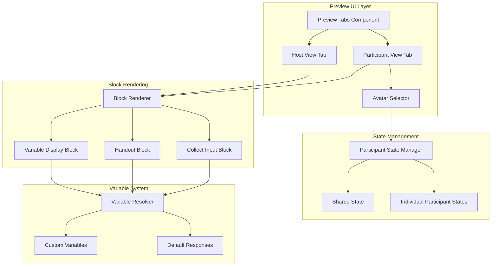

# Handout Preview Improvements Design Document

## Overview

This design enhances the preview functionality for the Handout (Assignment Display) block by introducing a tab-based dual-view system with participant state management. The design addresses two key issues: (1) the inability to see both participant and host perspectives during preview, and (2) incorrect response storage and display when using custom variables for shared state.

The solution consists of three main components:

1. **Tab-Based Preview UI**: A tabbed interface allowing SI leaders to switch between Participant View and Host View
2. **Participant State Manager**: A system for managing multiple mock participants with independent state
3. **Simplified Variable Storage**: Streamlined logic in BlockRenderer for storing and retrieving responses using custom variables

## Architecture

### High-Level Architecture



## Components and Interfaces

### 1. Preview Tabs Component

**Purpose**: Provide tab-based navigation between Participant and Host views

**Component Structure**:

```typescript
interface PreviewTabsProps {
  activity: Activity;
  currentSlide: Slide;
}

function PreviewTabs({ activity, currentSlide }: PreviewTabsProps) {
  const [activeTab, setActiveTab] = useState<"participant" | "host">(
    "participant"
  );

  return (
    <Tabs value={activeTab} onValueChange={setActiveTab}>
      <TabsList>
        <TabsTrigger value="participant">Participant View</TabsTrigger>
        <TabsTrigger value="host">Host View</TabsTrigger>
      </TabsList>

      <TabsContent value="participant">
        <ParticipantPreviewView
          activity={activity}
          currentSlide={currentSlide}
        />
      </TabsContent>

      <TabsContent value="host">
        <HostPreviewView activity={activity} currentSlide={currentSlide} />
      </TabsContent>
    </Tabs>
  );
}
```

### 2. Participant State Manager

**Purpose**: Manage multiple mock participants with independent state

**Interface**:

```typescript
interface MockParticipant {
  id: string;
  name: string;
  avatarNumber: number;
  isHost: boolean;
}

interface ParticipantState {
  participantId: string;
  responses: Record<string, any>; // blockId -> response
  customVariables: Record<string, any>; // variableName -> value
  assignments: Record<string, string[]>; // blockId -> assignedItemIds
}

interface ParticipantStateManager {
  // Participant management
  participants: MockParticipant[];
  currentParticipantId: string;

  addParticipant(): MockParticipant;
  removeParticipant(id: string): void;
  setCurrentParticipant(id: string): void;

  // State management
  getParticipantState(id: string): ParticipantState;
  updateParticipantState(id: string, updates: Partial<ParticipantState>): void;

  // Shared state (aggregated from all participants)
  getSharedState(): PreviewState;
  updateSharedState(updates: Partial<PreviewState>): void;
}
```

**Implementation**:

```typescript
class PreviewParticipantManager implements ParticipantStateManager {
  private participants: MockParticipant[] = [];
  private participantStates: Map<string, ParticipantState> = new Map();
  private currentParticipantId: string = "";
  private sharedState: PreviewState = { phase: "initial", responses: {} };

  constructor() {
    // Initialize with 3 default participants
    for (let i = 1; i <= 3; i++) {
      this.addParticipant();
    }
    this.currentParticipantId = this.participants[0].id;
  }

  addParticipant(): MockParticipant {
    const id = `participant-${crypto.randomUUID()}`;
    const participant: MockParticipant = {
      id,
      name: `Participant ${this.participants.length + 1}`,
      avatarNumber: (this.participants.length % 116) + 1, // Cycle through 116 avatars
      isHost: false,
    };

    this.participants.push(participant);
    this.participantStates.set(id, {
      participantId: id,
      responses: {},
      customVariables: {},
      assignments: {},
    });

    return participant;
  }

  removeParticipant(id: string): void {
    this.participants = this.participants.filter((p) => p.id !== id);
    this.participantStates.delete(id);

    // If current participant was removed, switch to first available
    if (this.currentParticipantId === id && this.participants.length > 0) {
      this.currentParticipantId = this.participants[0].id;
    }
  }

  setCurrentParticipant(id: string): void {
    if (this.participantStates.has(id)) {
      this.currentParticipantId = id;
    }
  }

  getParticipantState(id: string): ParticipantState {
    return (
      this.participantStates.get(id) || {
        participantId: id,
        responses: {},
        customVariables: {},
        assignments: {},
      }
    );
  }

  updateParticipantState(id: string, updates: Partial<ParticipantState>): void {
    const current = this.getParticipantState(id);
    this.participantStates.set(id, { ...current, ...updates });

    // Update shared state to reflect changes
    this.rebuildSharedState();
  }

  getSharedState(): PreviewState {
    return this.sharedState;
  }

  updateSharedState(updates: Partial<PreviewState>): void {
    this.sharedState = { ...this.sharedState, ...updates };
  }

  private rebuildSharedState(): void {
    // Aggregate responses from all participants
    const aggregatedResponses: Record<string, any> = {};
    const aggregatedCustomVars: Record<string, any> = {};

    this.participantStates.forEach((state) => {
      // Merge responses
      Object.entries(state.responses).forEach(([blockId, response]) => {
        if (!aggregatedResponses[blockId]) {
          aggregatedResponses[blockId] = {};
        }
        aggregatedResponses[blockId][`${state.participantId}-${Date.now()}`] =
          response;
      });

      // Merge custom variables
      Object.entries(state.customVariables).forEach(([varName, value]) => {
        if (!aggregatedCustomVars[varName]) {
          aggregatedCustomVars[varName] = {};
        }
        aggregatedCustomVars[varName][`${state.participantId}-${Date.now()}`] =
          value;
      });
    });

    this.sharedState = {
      ...this.sharedState,
      responses: aggregatedResponses,
      ...aggregatedCustomVars, // Spread custom variables at root level
    };
  }
}
```

### 3. Participant Preview View

**Purpose**: Display the participant perspective with avatar selector

**Component Structure**:

```typescript
interface ParticipantPreviewViewProps {
  activity: Activity;
  currentSlide: Slide;
}

function ParticipantPreviewView({
  activity,
  currentSlide,
}: ParticipantPreviewViewProps) {
  const participantManager = useParticipantManager();
  const [currentParticipant, setCurrentParticipant] = useState(
    participantManager.participants[0]
  );

  const handleAddParticipant = () => {
    const newParticipant = participantManager.addParticipant();
    setCurrentParticipant(newParticipant);
  };

  const handleSelectParticipant = (participant: MockParticipant) => {
    participantManager.setCurrentParticipant(participant.id);
    setCurrentParticipant(participant);
  };

  // Get context for current participant
  const participantState = participantManager.getParticipantState(
    currentParticipant.id
  );
  const sharedState = participantManager.getSharedState();

  const ctx: Partial<PlayfieldContext> = {
    userId: currentParticipant.id,
    isHost: false,
    state: sharedState,
    setState: (newState) => {
      participantManager.updateSharedState(newState);
    },
    mockParticipants: participantManager.participants,
    call: createMockCall(participantManager),
  };

  return (
    <div className="space-y-4">
      {/* Avatar Selector */}
      <div className="flex items-center gap-2 p-4 border-b">
        <span className="text-sm font-medium">Viewing as:</span>
        <div className="flex gap-2 flex-wrap">
          {participantManager.participants.map((participant) => (
            <button
              key={participant.id}
              onClick={() => handleSelectParticipant(participant)}
              className={cn(
                "w-10 h-10 rounded-full border-2 transition-all",
                currentParticipant.id === participant.id
                  ? "border-primary-500 ring-2 ring-primary-200"
                  : "border-border hover:border-primary-300"
              )}
            >
              <Avatar>
                <AvatarImage
                  src={`/avatars/Number=${participant.avatarNumber}.png`}
                  alt={participant.name}
                />
                <AvatarFallback>{participant.name[0]}</AvatarFallback>
              </Avatar>
            </button>
          ))}
          <Button
            variant="outline"
            size="icon"
            onClick={handleAddParticipant}
            className="w-10 h-10 rounded-full"
          >
            <Plus className="w-4 h-4" />
          </Button>
        </div>
        <span className="text-sm text-muted-foreground ml-auto">
          {currentParticipant.name}
        </span>
      </div>

      {/* Block Renderer */}
      <div className="p-6">
        {currentSlide.blocks.map((block) => (
          <BlockRenderer
            key={block.id}
            block={block}
            ctx={ctx}
            activitySlug={activity.slug}
          />
        ))}
      </div>
    </div>
  );
}
```

### 4. Host Preview View

**Purpose**: Display the host perspective with controls

**Component Structure**:

```typescript
interface HostPreviewViewProps {
  activity: Activity;
  currentSlide: Slide;
}

function HostPreviewView({ activity, currentSlide }: HostPreviewViewProps) {
  const participantManager = useParticipantManager();
  const sharedState = participantManager.getSharedState();

  const ctx: Partial<PlayfieldContext> = {
    userId: "host",
    isHost: true,
    state: sharedState,
    setState: (newState) => {
      participantManager.updateSharedState(newState);
    },
    mockParticipants: participantManager.participants,
    call: createMockCall(participantManager),
  };

  return (
    <div className="space-y-4 p-6">
      <div className="flex items-center gap-2 mb-4">
        <Badge variant="secondary">Host View</Badge>
        <span className="text-sm text-muted-foreground">
          {participantManager.participants.length} participants
        </span>
      </div>

      {/* Render blocks with host controls */}
      {currentSlide.blocks.map((block) => (
        <div key={block.id} className="space-y-2">
          <BlockRenderer block={block} ctx={ctx} activitySlug={activity.slug} />

          {/* Show host controls for handout blocks */}
          {block.type === BlockType.HANDOUT && (
            <AssignmentHostControl
              block={block}
              ctx={ctx}
              activitySlug={activity.slug}
            />
          )}
        </div>
      ))}
    </div>
  );
}
```

### 5. Simplified BlockRenderer Response Storage

**Purpose**: Remove unnecessary conditional checks and simplify response storage logic

**Updated CollectInputBlock Handler**:

```typescript
function CollectInputBlock({
  block,
  onSubmit,
  existingResponse,
}: {
  block: StrategyBlock;
  onSubmit: (response: any) => void;
  existingResponse?: any;
}) {
  const config = block.config as CollectInputConfig;
  const [value, setValue] = useState(existingResponse || "");

  const handleSubmit = (e: React.FormEvent) => {
    e.preventDefault();
    onSubmit(value);
    setValue("");
  };

  // ... render logic
}
```

**Updated handleSubmit in BlockRenderer**:

```typescript
const handleSubmit = (response: any) => {
  if (!ctx.call || !ctx.state || !ctx.setState || !ctx.userId) return;

  const blockConfig = block.config as CollectInputConfig;

  // Send event through context
  ctx.call.sendCustomEvent({
    type: `${activitySlug}:submit-${block.id}`,
    userId: ctx.userId,
    response,
  });

  // Determine storage location based on saveToSharedState flag
  if (blockConfig.saveToSharedState && blockConfig.variableName) {
    // Store in custom variable at root level of state
    const customVarResponses = {
      ...(ctx.state[blockConfig.variableName] || {}),
      [`${ctx.userId}-${crypto.randomUUID()}`]: response,
    };

    ctx.setState({
      ...ctx.state,
      [blockConfig.variableName]: customVarResponses,
    });
  } else {
    // Store in default responses structure
    const newResponses = {
      ...ctx.state.responses,
      [block.id]: {
        ...(ctx.state.responses?.[block.id] || {}),
        [`${ctx.userId}-${crypto.randomUUID()}`]: response,
      },
    };

    ctx.setState({
      ...ctx.state,
      responses: newResponses,
    });
  }
};
```

### 6. Variable Resolver Updates

**Purpose**: Ensure custom variables are resolved correctly from root level of state

**Updated resolveVariable Function**:

```typescript
export function resolveVariable(
  variablePath: string,
  context: VariableContext
): any {
  // Check predefined accessors first
  if (VARIABLE_ACCESSORS[variablePath]) {
    return VARIABLE_ACCESSORS[variablePath](context);
  }

  // Check root level of state for custom variables
  if (context.state[variablePath] !== undefined) {
    const value = context.state[variablePath];

    // If it's an object with userId-uuid keys, convert to array
    if (typeof value === "object" && value !== null && !Array.isArray(value)) {
      const entries = Object.entries(value);
      if (entries.length > 0 && entries[0][0].includes("-")) {
        // Convert to array of values
        return entries.map(([, val]) => ({
          id: crypto.randomUUID(),
          content: val,
          authorId: entries[0][0].split("-")[0],
          createdAt: Date.now(),
        }));
      }
    }

    return value;
  }

  // Fall back to dot notation path resolution
  const parts = variablePath.split(".");
  let current: any = context.state;

  for (const part of parts) {
    if (current === null || current === undefined) {
      return undefined;
    }
    current = current[part];
  }

  return current;
}
```

## Data Models

### Mock Participant

```typescript
interface MockParticipant {
  id: string;
  name: string;
  avatarNumber: number; // 1-116 for avatar images
  isHost: boolean;
}
```

### Participant State

```typescript
interface ParticipantState {
  participantId: string;

  // Default responses (when saveToSharedState is false)
  responses: Record<string, any>; // blockId -> response value

  // Custom variables (when saveToSharedState is true)
  customVariables: Record<string, any>; // variableName -> response value

  // Assignments for this participant
  assignments: Record<string, string[]>; // blockId -> array of assigned item IDs
}
```

### Extended Preview State

```typescript
interface PreviewState {
  phase: string;

  // Default responses structure (aggregated from all participants)
  responses: Record<string, Record<string, any>>; // blockId -> { userId-uuid -> response }

  // Custom variables at root level (aggregated from all participants)
  [customVariableName: string]: Record<string, any>; // { userId-uuid -> response }

  // Assignments
  assignments?: Record<string, AssignmentMap>; // blockId -> AssignmentMap

  // Assignment responses
  assignmentResponses?: Record<string, AssignmentResponse[]>; // blockId -> responses
}
```

## Mock Call Implementation

**Purpose**: Simulate Stream.io call functionality for preview mode

```typescript
function createMockCall(participantManager: ParticipantStateManager) {
  return {
    sendCustomEvent: (event: any) => {
      console.log("Mock event sent:", event);

      // Handle assignment creation events
      if (event.type.includes("assignments-created")) {
        const sharedState = participantManager.getSharedState();
        participantManager.updateSharedState({
          ...sharedState,
          assignments: {
            ...sharedState.assignments,
            [event.blockId]: event.assignments,
          },
        });
      }

      // Handle assignment clear events
      if (event.type.includes("assignments-cleared")) {
        const sharedState = participantManager.getSharedState();
        const newAssignments = { ...sharedState.assignments };
        delete newAssignments[event.blockId];

        participantManager.updateSharedState({
          ...sharedState,
          assignments: newAssignments,
        });
      }
    },
  };
}
```

## UI/UX Design

### Preview Layout

```
┌─────────────────────────────────────────────────────────┐
│  Activity Preview                                        │
├─────────────────────────────────────────────────────────┤
│  [Participant View] [Host View]                         │
├─────────────────────────────────────────────────────────┤
│                                                          │
│  PARTICIPANT VIEW TAB:                                   │
│  ┌────────────────────────────────────────────────────┐ │
│  │ Viewing as: [👤] [👤] [👤] [+]  Participant 1     │ │
│  └────────────────────────────────────────────────────┘ │
│                                                          │
│  ┌────────────────────────────────────────────────────┐ │
│  │  Block Content                                      │ │
│  │  (Rendered from participant perspective)            │ │
│  └────────────────────────────────────────────────────┘ │
│                                                          │
│  HOST VIEW TAB:                                          │
│  ┌────────────────────────────────────────────────────┐ │
│  │  [Host View] 3 participants                         │ │
│  └────────────────────────────────────────────────────┘ │
│                                                          │
│  ┌────────────────────────────────────────────────────┐ │
│  │  Block Content                                      │ │
│  │  (Rendered from host perspective)                   │ │
│  │                                                      │ │
│  │  Host Controls:                                     │ │
│  │  [Distribution Mode ▼] [Assign]                    │ │
│  └────────────────────────────────────────────────────┘ │
│                                                          │
└─────────────────────────────────────────────────────────┘
```

### Avatar Selector Design

- Circular avatar buttons with participant images
- Active participant has primary border and ring
- Hover state shows border color change
- Plus button to add new participants
- Participant name displayed on the right

### Tab Styling

- Use shadcn Tabs component
- Clear visual distinction between active and inactive tabs
- Badge indicators for view type (Participant/Host)
- Participant count shown in host view

## Error Handling

### Missing Custom Variable

```typescript
if (blockConfig.saveToSharedState && !blockConfig.variableName) {
  console.error(
    `Block ${block.id} has saveToSharedState enabled but no variableName configured`
  );
  // Fall back to default responses structure
  // ... store in responses[blockId]
}
```

### Variable Resolution Errors

```typescript
export function resolveVariable(
  variablePath: string,
  context: VariableContext
): any {
  try {
    // ... resolution logic
  } catch (error) {
    console.error(`Failed to resolve variable "${variablePath}":`, error);
    return undefined;
  }
}
```

### Empty Assignments

```typescript
if (!assignments || assignedItems.length === 0) {
  return <NoAssignmentState />;
}
```

## Testing Strategy

### Unit Testing

**Participant State Manager Tests**:

- Add/remove participants
- Switch current participant
- Update participant state
- Rebuild shared state from participant states
- Handle custom variables correctly

**Variable Resolver Tests**:

- Resolve custom variables from root level
- Convert userId-uuid objects to arrays
- Handle missing variables gracefully
- Support dot notation paths

**BlockRenderer Tests**:

- Store responses in custom variables when configured
- Store responses in default structure when not configured
- Handle missing variableName gracefully

### Integration Testing

**Preview Flow Tests**:

1. Create activity with Collect Input (custom variable) → Handout → Variable Display
2. Switch to Participant View
3. Submit responses as different participants
4. Verify responses appear in Variable Display
5. Switch to Host View
6. Create assignments
7. Switch back to Participant View
8. Verify each participant sees only their assigned items

### Visual Testing

- Tab switching works smoothly
- Avatar selector displays correctly
- Active participant is visually distinct
- Host controls appear only in Host View
- Participant name updates when switching

## Performance Considerations

### State Management

- Use React Context for participant manager to avoid prop drilling
- Memoize participant state to prevent unnecessary re-renders
- Debounce shared state updates when multiple participants submit simultaneously

### Rendering Optimization

- Use React.memo for BlockRenderer components
- Only re-render active tab content
- Lazy load participant avatars

### Memory Management

- Clean up participant states when participants are removed
- Limit maximum number of participants (e.g., 10)
- Clear old event listeners when switching participants

## Accessibility

- Keyboard navigation for tab switching (Tab, Arrow keys)
- Keyboard navigation for avatar selector (Arrow keys, Enter)
- Screen reader announcements when switching participants
- ARIA labels for all interactive elements
- Focus management when tabs change

## Migration Notes

### Breaking Changes

None - this is an enhancement to existing preview functionality

### Backward Compatibility

- Existing preview functionality remains unchanged
- New tab-based UI is additive
- BlockRenderer changes are internal and don't affect API

### Deployment Considerations

- No database migrations required
- No API changes required
- Frontend-only changes
- Can be deployed independently

## Future Enhancements

1. **Participant Persistence**: Save mock participants between preview sessions
2. **Participant Profiles**: Allow customizing participant names and avatars
3. **Response History**: Show timeline of responses for each participant
4. **Bulk Actions**: Submit responses for all participants at once
5. **Export Preview Data**: Export preview session data for analysis
6. **Collaborative Preview**: Allow multiple SI leaders to preview together
